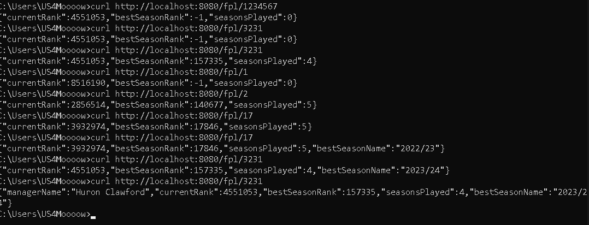

# FPL Analyzer 

I love the Premier League and Fantasy Premier League.

I also kind of hate it sometimes.

So I built this tool.

This app lets you pull your FPL data and shows helpful stats like season ranks, total points and more using only your **FPL ID**.

it was built using Spring Boot for Backend and React for Frontend.

## Features
- See your FPL history accross seasons
- Charts for ranks and total points
- Clean UI to browse your team stats

## Screenshots & Demo

### Test with cURL



### Quick Video Demo

I'll add it later.

## Tech Stack

- **Backend:** Java 17, Spring Boot
- **Frontend:** React

## Run it locally
1- Clone the repo:

```bash

git clone https://github.com/oussamaelmessaoudi/fpl-analyzer.git
```

2- Start backend server:

```bash

cd fpl-analyzer

mvn spring-boot:run 
```

3- Start frontend server:

```bash

cd frontend/

npm install

npm start
```


That's it. Have fun or even get frustrated like the rest of us FPL Players xD

## Contribute

PR are welcomed.

if you don't like the way i coded something, fork the repo and go wild, the floor is yours.

## Author

Oussama ELMESSAOUDI - Java Backend developer and FPL enthusiat

Reach me out here : [LinkedIn](https://www.linkedin.com/in/usama-elmessaoudi)
